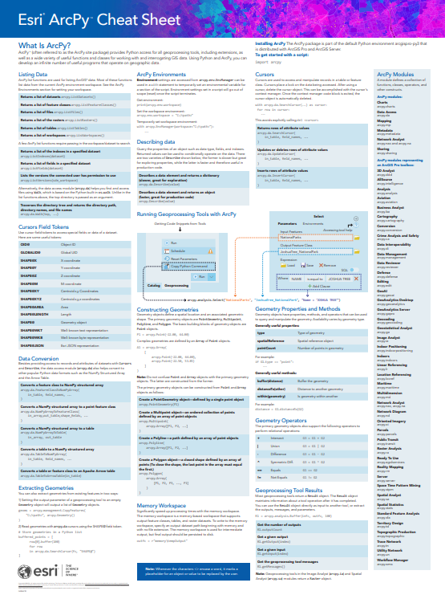
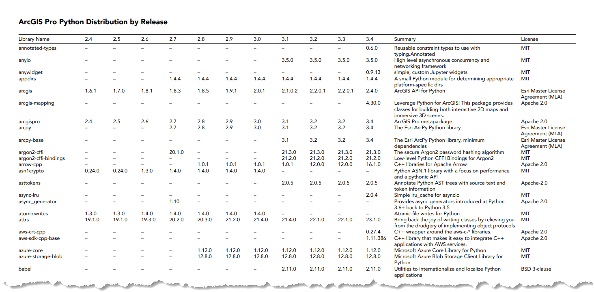

# arcpy
Resources and ideas about arcpy and Python in ArcGIS.

ArcPy is a comprehensive and powerful library for geographic data analysis, data conversion, data management, map automation. It is integrated into products like ArcGIS Pro and Enterprise. ArcPy is organized into 55 modules and 2100+ functions to the related [Geoprocessing tools](https://pro.arcgis.com/en/pro-app/latest/help/analysis/geoprocessing/basics/what-is-geoprocessing-.htm), see [this quick tour](https://pro.arcgis.com/en/pro-app/latest/arcpy/get-started/a-quick-tour-of-arcpy.htm) of it's functionality.

## arcpy cheatsheet.pdf
cheatsheet for the arcpy library. [Download](ArcPy-Cheatsheet.pdf?raw=true)

## ArcGIS-Pro-Python-Distribution-By-Release.pdf
A list of packages and their versions shipped with recent ArcGIS Pro releases. [Download](ArcGIS-Pro-Python-Distribution-By-Release.pdf?raw=true)

## Software issues, questions and ideas

 - the primary way to report technical issues continues to be through tech support
 - ideas and enhancements can be submitted on the [ArcGIS Ideas](https://community.esri.com/t5/custom/page/page-id/arcgis-ideas) site, or through tech support
 - for conversation with peers in the Esri's python developer community see [Python](https://community.esri.com/t5/python/ct-p/python) on esri's community forums
 - for issues and questions about the "ArcGIS API for Python", please go to [github.com/Esri/arcgis-python-api](https://github.com/Esri/arcgis-python-api)
 - if none of the above are quite right, open a new issue in this repo

## Contributing

Esri welcomes contributions from anyone and everyone. Please see our [guidelines for contributing](https://github.com/esri/contributing).

## Licensing

Copyright 2024 Esri

Licensed under the Apache License, Version 2.0 (the "License");
you may not use this file except in compliance with the License.
You may obtain a copy of the License at

   http://www.apache.org/licenses/LICENSE-2.0

Unless required by applicable law or agreed to in writing, software
distributed under the License is distributed on an "AS IS" BASIS,
WITHOUT WARRANTIES OR CONDITIONS OF ANY KIND, either express or implied.
See the License for the specific language governing permissions and
limitations under the License.

A copy of the license is available in the repository's [LICENSE.txt](https://github.com/ArcGIS/arcpy/LICENSE.txt) file.

(<a href="#readme-top"> back to top ☝</a>)

